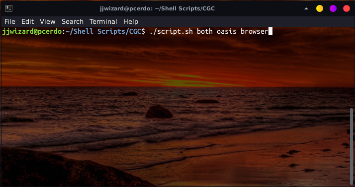
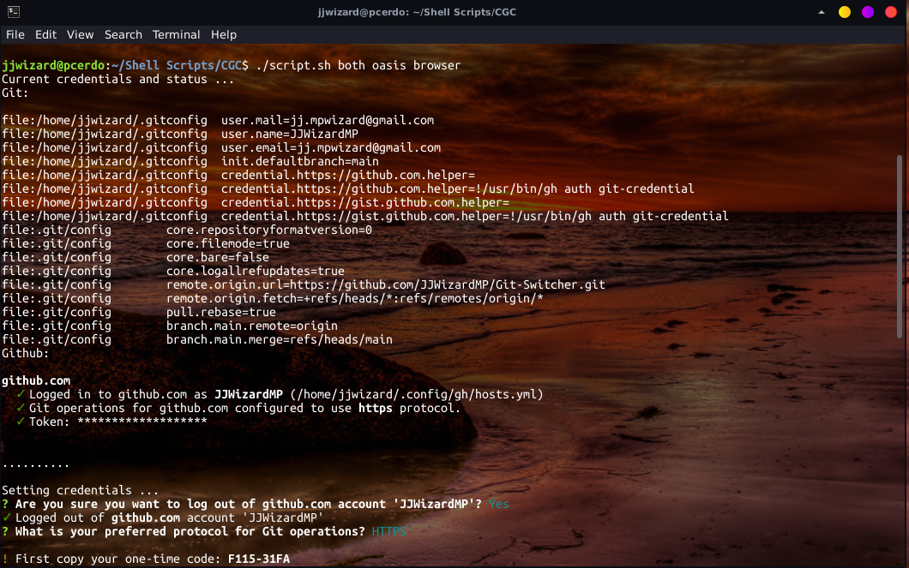
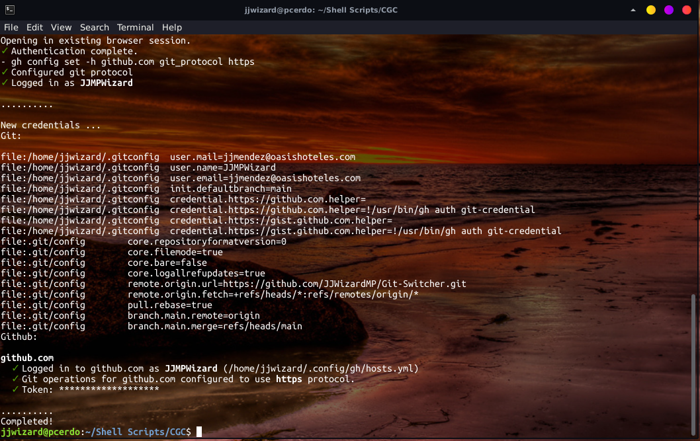

## Git and Github Switcher Credentials


## Introduction

I wanted to create this script for to switch my git accounts(from the work, university and my personal account) easier only running a bash script.

I used these shell command line tools in this project:

- jq: a shell command line for read easily a json file.
- git: a shell command line for manage a control of versions for software projects.
- github-cli: a shell command line for 
connect with the github page repository.

## Requeriments

- Write a bash script that allows switch git and github accounts.

## Demo

- [Repository](https://github.com/JJWizardMP/Git-Switcher)

## Images

### Typing command line script



### Running script

Showing current credentials:

Showing new credentials: 


## Technologies

#### Command line

| [jq](https://stedolan.github.io/jq/) | [Git](https://git-scm.com/) | [Github-cli](https://cli.github.com/) |
| :----------------------------------: | :-------------------------: | :-----------------------------------: |

## Application Installation

### Git Switcher:

We need to assing permisions for run the requirements intaller script and the main script(Do not forget config your config.json and add your credentials).

```sh
$ chmod u+x script.sh requirements.sh
```

Run the requirements script with one argument(the argument is your operating system).

Arguments:
- system: "mac" or "linux"

```sh
$ ./requirements.sh linux
```

Run the main script but first we need to specify 2 arguments, the third argument is optional only if you pass "github" or "both" as the first argument, in other case is not necessary.

Arguments:
- command: "git", "github" or "both"
- account: name of account in the config.json
- method: "token" or "browser"


```sh
$ ./script.sh both jjwizard browser
```

## Aditional Recommendation 

if you use visual code as your IDE, we recommend use the browser auth mode because you log in github-cli and github page in your default browser(Be sure you are logout of github in your browser), if you use token auth, you only log in github-cli.

## Contributors

This project was written by:

- Programmer :
  - [Joan de Jesús Méndez Pool](https://github.com/JJWizardMP)
